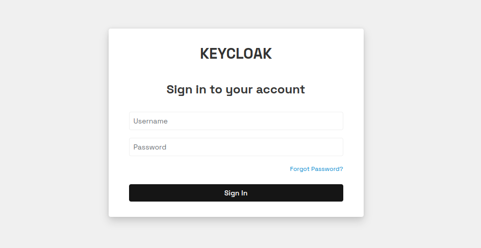

# Keycloak Theme Customization



This repository contains a customized theme for Keycloak, an open-source identity and access management solution. The customized theme allows you to modify the look and feel of the Keycloak user interface to align with your branding and user experience requirements.

## Development

For local development, you can use Docker Compose to quickly spin up a Keycloak instance. This allows you to test your theme customizations without affecting your production environment.

To use Docker Compose:

1. Install Docker and Docker Compose on your machine.
2. Open a terminal and navigate to the repository's root directory.
3. Run the following command: `docker-compose up -d`
4. Wait for the Keycloak container to start.
5. Access the Keycloak admin console by visiting `http://localhost:8080/auth/admin/`.
6. Log in using the default admin credentials (username: `admin`, password: `admin`).
7. Follow the steps mentioned in the "Installation" section to apply and test your customized theme.

To stop the Keycloak container, run `docker-compose down`.

## Customization Process

To customize the Keycloak theme for your specific needs, you can follow these steps:

1. Clone this repository to your local machine.
2. Navigate to the `themes/custom-theme` folder.
3. Modify the template files (e.g., HTML, CSS) and resources (e.g., images) according to your branding and design requirements.
4. Update any necessary configurations or properties related to the theme customization.
5. Save your changes.

## Building the Theme

To package the customized theme into a JAR file for use with Keycloak, you can use the provided shell script:

1. Ensure you have Java and the `jar` command installed on your system.
2. Open a terminal and navigate to the repository's root directory.
3. Run the following command: 

```sh
./package.sh
```
4. Follow the prompts to provide the JAR file name and confirm the customization.

The script will create a JAR file containing the customized theme and place it in the `providers` directory.

## Installation

To install and use the customized theme in Keycloak:

1. Copy the generated JAR file (`custom-theme.jar`) from the `providers` directory to the Keycloak server's `standalone/deployments` directory.
2. Start or restart the Keycloak server.
3. Log in to the Keycloak admin console.
4. Navigate to the desired realm.
5. Go to the "Realm Settings" > "Themes" section.
6. Select the customized theme from the available options for each desired theme (e.g., Login, Account, Admin).
7. Save the changes.

The customized theme will now be applied to the corresponding Keycloak pages.

## Contributing

If you find any issues or have suggestions for improvement, please feel free to contribute by opening an issue or submitting a pull request. Your contributions are greatly appreciated.

## Documentation

- [Keycloak Documentation](https://www.keycloak.org/documentation)
- [Keycloak Theme Developer Guide](https://www.keycloak.org/docs/latest/server_development/#_themes)

## License

This repository is licensed under the [MIT License](LICENSE).

